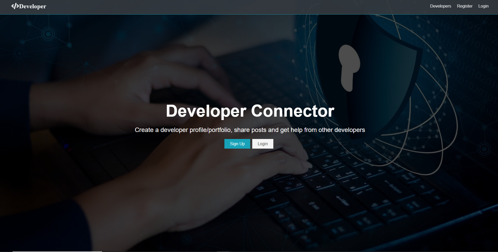
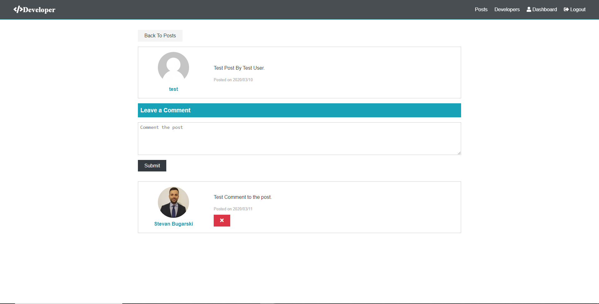
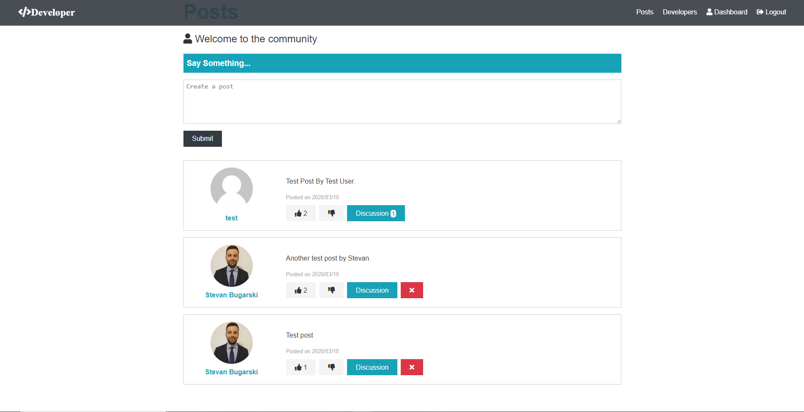
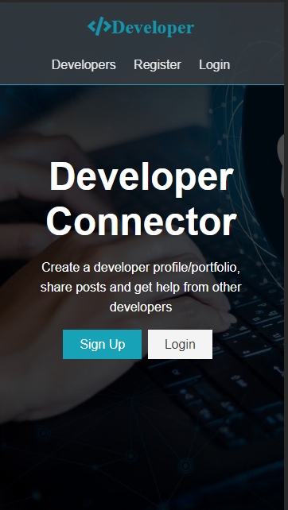

<h1>E-commerce website</h1>

<b>Name: Stevan Bugarski</b>

<b>Organization: Wagner college</b>

<b>Program: Full Stack Web Development Bootcamp</b>

<b>Project: Website With a Search Engine</b>

<h2>Project overview:</h2>

 This is a full stack web application, small social network app that includes authentication, profiles and forum posts. 

<ol>
 <h2>Installation:</h2>
  <li>Install node.js on youre  machine if you don't have it install.</li>
	<li>Download the zip file of the project.</li>
	<li>Unzip the file and save it.</li>
  <li>In config folder create default.json file with the folowing:
  {
  "mongoURI": "<your_mongoDB_Atlas_uri_with_credentials>",
  "jwtSecret": "secret",
  "githubToken": ""
}
  </li>
  <li>Login to MongoDB Atlas, create a new database . Set up database access and network access and copy the connection string</li>
  <li>You need github Id and github secret key which you can get from Github when you register your application. </li>
	<li>Find the project in the terminal and type npm i.</li>
  <li>Change directory to client typing cd client</li>
  <li>When you changed directory to client type npm i.</li>
  <li>Go back to the root directory.</li>
  <li>Type in terminal npm run dev to lunch application locally.</li>

</ol>

<h2>Requirements:</h2>
<ol><h3>User Stories:<h3>
  <li><em>As a junior web developer I want to be able to live posts when I get stuck with codding so that I can get a help from other developers.<em></li>
	<li><em>As a web developer I want to be in touch with other developers so that I can share my knowledge</em></li>
	<h2>Wiraframes:</h2>
	</ol>
	
	
<ol><h2>Development process: </h2>
	<li>Created GitHub repository Developer.</li>
  <li>Cloned repository locally.</li>
	<li>Created the project.</li>
	<li>Did Express & MongoDB Setup.</li>
	<li>Created the backend part of application and tested along the way using Postman.</li>
	<li>Created react App.</li>
	<li>Set up Redux.</li>
	<li>Wrote front end code of the application.</li>
  <li>Deployed application on Herocu<a href='https://still-thicket-35591.herokuapp.com/'>https://still-thicket-35591.herokuapp.com/</a>.</li>
	</ol>
<ol><h3>Tehnologies used for this project:</h3>
	<li>HTML,</li>
	<li>CSS,,</li>
	<li>Git,</li>
	<li>Node.js, JavaScrit, React</li>
	</ol>
<h3>Results:</h3>
<h4>Desktop views:</h4>

<h4>Mobile views:</h4>

<h3>Future improvements:</h3>

In the future I would like to improve my knowledge in React,React-Redux for front end, and Node.js, Python and Django for back end web development., 

